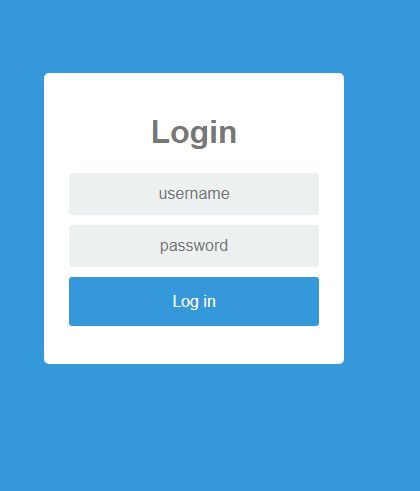
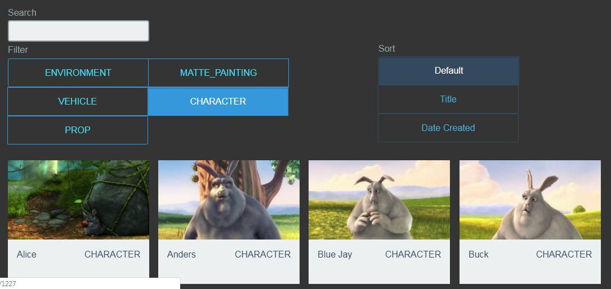

# flasksgasset
Flask showing asset of shotgun in a html page with awesome filter Shuffle

https://vestride.github.io/Shuffle/

# dependences:

https://github.com/shotgunsoftware/python-api

# Installation 

Modify the app.py with the subdomain shotgun, the name script , the key, and the id of your project.
There's a page login ,the login is admin , password : password.

virtualenv ...

pip install -r requirement.txt

python  app.py 

or still wip appf.py

Then you will have a page with all asset of your projet, so you can browse them, filter by category.

